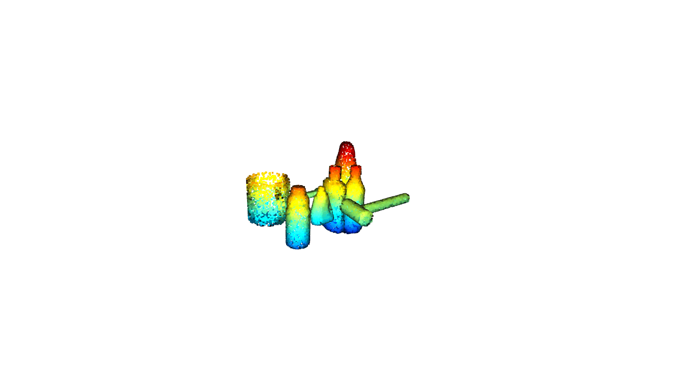
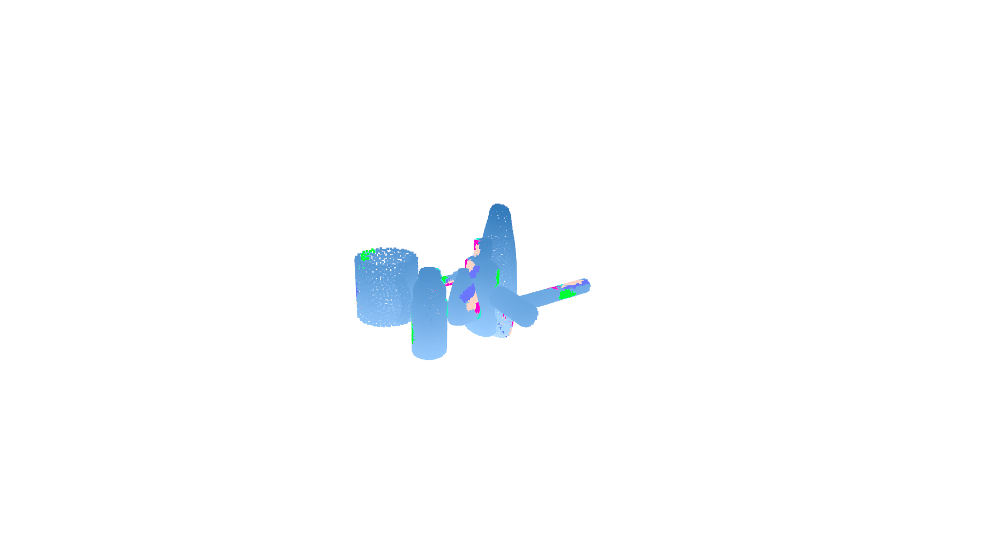

# Multi-fingered Robotic Hand Grasping in Cluttered Environments through Hand-object Contact Semantic Mapping

[Project Page](https://sites.google.com/view/ffh-cluttered-grasping) [arXiv](https://arxiv.org/abs/2404.08844v2) [PDF](https://arxiv.org/pdf/2404.08844v2)


## Example of FFHClutteredGrasping dataset
Grasping Candidates and Contact Distance Map.               |  Cluttered Scene
:-------------------------:|:-------------------------:
Blue: Candidate under Collision, <br />Green: Positive Candidate, <br /> Red: Negative Candidate  |  

Contact Semantic Map             |  Affordance Map
:-------------------------:|:-------------------------:
  |  
<!-- 

 -->


## Visualize example dataset

visualize example scene with cluttered grasping data of multi-fingered robotic hand with following modalities:
- collision score
- grasping quality
- contact distance map
- contact semantic map
- affordance information

```python
cd example_dataset
# visualize cluttered scene with grasp candidates, and corresponding collision score, grasp qualities, contact distance and semantic information
python visualize_scene.py

# visualize the affordance information
python visualize_affordance.py

```
P.S: In visualization, the model of robotic hand is a simplied version.