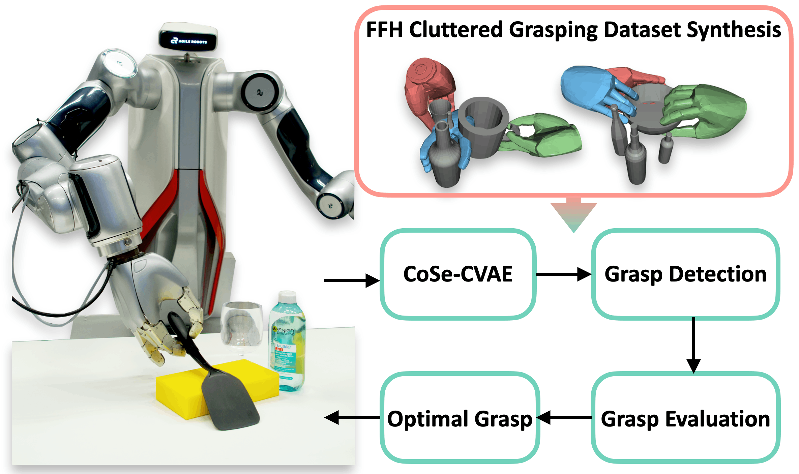
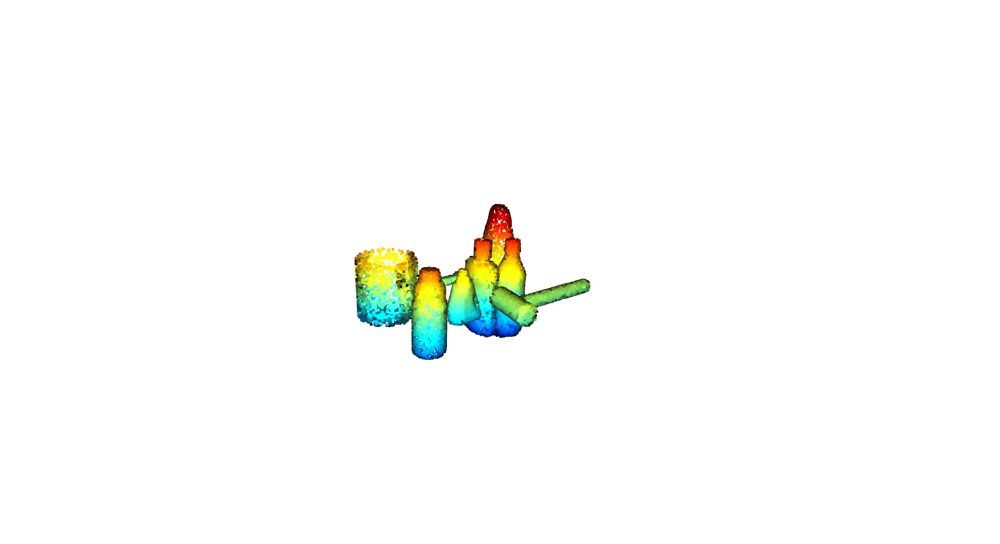
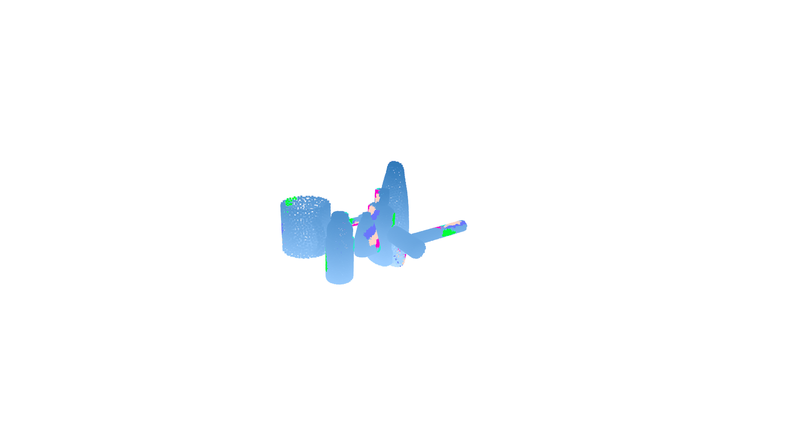

<h1 align="center">ContactDexNet: Multi-fingered Robotic Hand Grasping in Cluttered Environments through Hand-object Contact Semantic Mapping</h1>

<p align="center">
    <a href="https://arxiv.org/abs/2404.08844">
        
    </a>
    <a href="https://sites.google.com/view/contact-dexnet">
        
    </a>
</p>
<p align="center">
    <a href="https://leizhang-public.github.io/">Lei Zhang</a>, 
    <a href="https://baikaixin-public.github.io/">Kaixin Bai</a>, 
    <a href="">Guowen Huang</a>, 
    <a href="https://www.ce.cit.tum.de/air/people/zhenshan-bing-drrernat/">Zhenshan Bing</a>, 
    <a href="https://ieeexplore.ieee.org/author/37404312400">Zhaopeng Chen</a>, 
    <a href="https://www.ce.cit.tum.de/air/people/prof-dr-ing-habil-alois-knoll/">Alois Knoll</a>, 
    <a href="https://ieeexplore.ieee.org/author/37281460600">Jianwei Zhang </a>
</p>
<p align="center">University of Hamburg, Agile Robots, Technical University of Munich</p>
<p align="center">
    <a href="https://sites.google.com/view/contact-dexnet" target="_blank">
        
    </a>
    <!-- <a href="https://sites.google.com/view/contact-dexnet" target="_blank">
        
    </a> -->
</p>

## Example of ContactDexNet dataset (previous FFHClutteredGrasping dataset)
Grasping Candidates and Contact Distance Map.               |  Cluttered Scene
:-------------------------:|:-------------------------:
Blue: Candidate under Collision, <br />Green: Positive Candidate, <br /> Red: Negative Candidate  |  

Contact Semantic Map             |  Affordance Map
:-------------------------:|:-------------------------:
  |  
<!-- 

 -->


## Visualize example dataset

visualize example scene with cluttered grasping data of multi-fingered robotic hand with following modalities:
- collision score
- grasping quality
- contact distance map
- contact semantic map
- affordance information

```python
cd example_dataset
# visualize cluttered scene with grasp candidates, and corresponding collision score, grasp qualities, contact distance and semantic information
python visualize_scene.py

# visualize the affordance information
python visualize_affordance.py

```
P.S: In visualization, the model of robotic hand is a simplied version.

# BibTex

If you find our work helpful, please consider citing it:

```bash
@article{zhang2024multi,
  title={Multi-fingered robotic hand grasping in cluttered environments through hand-object contact semantic mapping},
  author={Zhang, Lei and Bai, Kaixin and Huang, Guowen and Bing, Zhenshan and Chen, Zhaopeng and Knoll, Alois and Zhang, Jianwei},
  journal={arXiv preprint arXiv:2404.08844},
  year={2024}
}

@misc{zhang2025contactdexnetmultifingeredrobotichand,
      title={ContactDexNet: Multi-fingered Robotic Hand Grasping in Cluttered Environments through Hand-object Contact Semantic Mapping}, 
      author={Lei Zhang and Kaixin Bai and Guowen Huang and Zhenshan Bing and Zhaopeng Chen and Alois Knoll and Jianwei Zhang},
      year={2025},
      eprint={2404.08844},
      archivePrefix={arXiv},
      primaryClass={cs.RO},
      url={https://arxiv.org/abs/2404.08844}, 
}
```